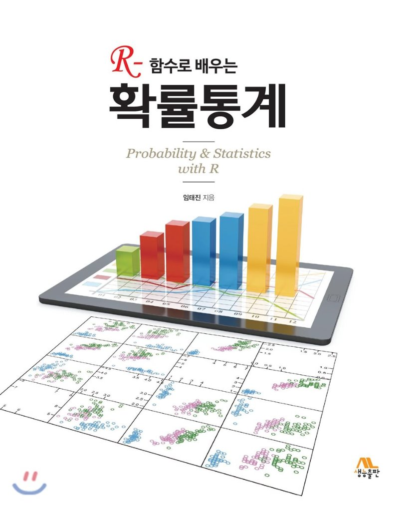

# Statistics

## 1. Statistics for Business

Statistics using R

**Introductory Statistics** : [https://saylordotorg.github.io/text\_introductory-statistics/](https://saylordotorg.github.io/text_introductory-statistics/)

* Publisher: Saylor Academy
* Year Published: 2012

**Probability & Statistics with R**

* Author: Lim, Taejin
* Publisher: Life and Power Press
* Year Published: 2019

Data Sets :

* [http://www.flatworldknowledge.com/sites/all/files/data1.xls](http://www.flatworldknowledge.com/sites/all/files/data1.xls%20)
* [http://www.flatworldknowledge.com/sites/all/files/data3.xls  ](http://www.flatworldknowledge.com/sites/all/files/data1.xls%20)
* [http://www.flatworldknowledge.com/sites/all/files/data7.xls ](http://www.flatworldknowledge.com/sites/all/files/data1.xls%20)
* [http://www.flatworldknowledge.com/sites/all/files/data10.xls ](http://www.flatworldknowledge.com/sites/all/files/data1.xls%20)

References

* [Online Statistics Education: An Interactive Multimedia Course of Study](http://onlinestatbook.com/2/index.html)
* \*\*\*\*[**Introduction to Econometrics with R**](https://www.econometrics-with-r.org/)\*\*\*\*
* [Statistics](https://m.blog.naver.com/PostList.nhn?blogId=mykepzzang&categoryNo=38&currentPage=10) \(Korean\)

## 2. Course Introduction

This is the book of statistics for Business students.

## 3. Course Schedule

## 4. Evaluation

Mid 30%, Final 30%, Assignment 20%, Class 20%

