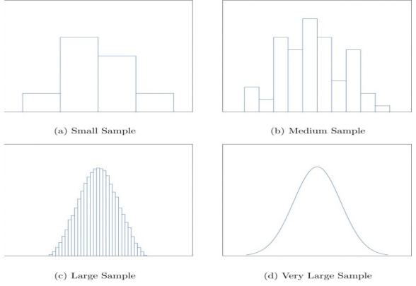

# 2-1. Three Popular Data Displays






## 1. Stem and Leaf Diagrams

**EXAMPLE 1.** 통계학 강의를 듣고 있는 30명 학생의 시험 성적은 다음과 같다.

```text
86 80 25 77  73 76 100 90 69 93
90 83 70 73  73 70  90 83 71 95
40 58 68 69 100 78  87 97 92 73
```

위의 데이터를 가시화하기 위한 방법 중 하나가 **stem and leaf diagram**이다.

R에서는 이러한 데이터 표현을 위해 `stem()` 함수를 사용한다.

**Syntax :**

```text
stem(x, scale = 1, width = 80, atom = 1e-08)
```

**arguments :**

* x : 수치형 벡터
* scale = : 플롯의 길이를 제어
* width = : 원하는 플롯의 넓이
* atom = : tolerance

**\[Solution\]**



```text
score <- c(86, 80, 25, 77, 73,  76, 100, 90, 69, 93,
           90, 83, 70, 73, 73,  70,  90, 83, 71, 95,
           40, 58, 68, 69, 100, 78,  87, 97, 92, 73)
stem(score)
```



```text
##   The decimal point is 1 digit(s) to the right of the |
## 
##    2 | 5
##    3 | 
##    4 | 0
##    5 | 8
##    6 | 899
##    7 | 0013333678
##    8 | 03367
##    9 | 0002357
##   10 | 00
##
```



10의 자리 숫자가 stem이 되고, 1의 자리 숫자가 leaf가 됨을 알 수 있다.


**EXAMPLE 2.**  stem의 갯수를 반으로 줄여서 diagram을 그려라.

**\[Solution\]**



```text
score <- c(86, 80, 25, 77, 73,  76, 100, 90, 69, 93,
           90, 83, 70, 73, 73,  70,  90, 83, 71, 95,
           40, 58, 68, 69, 100, 78,  87, 97, 92, 73)
           
stem(score, scale = 0.5)    # stem의 갯수를 50%로 줄임 -> 2, 4, 6, 8, 10 등
```



```text
##   The decimal point is 1 digit(s) to the right of the |
## 
##    2 | 5
##    4 | 08
##    6 | 8990013333678
##    8 | 033670002357
##   10 | 00
##
```



## 2. Frequency Histograms

stem and leaf diagram은 대규모 데이터 세트에는 적합하지 않다.

이 때 사용되는 방법이 **도수 분포**이다.

```text
hist(x, main = paste("Histogram of ", xname), 
        xlim = range(breaks),
        ylim = NULL,
        xlab = xname, 
        ylab = 
        ... )
```

**arguments :**

* `x` : 히스토그램의 벡터 데이터
* `main =` : 히스토그램의 제목
* `xlim =` : x 축의 범위
* `ylim =` : y 축의 범위
* `xlab =` : x 축의 제목
* `ylab =` : y 축의 제목

**EXAMPLE 3.** 이전의 stem and leaf diagram을 frequency histogram으로 그려라.



```text
score <- c(86, 80, 25, 77, 73,  76, 100, 90, 69, 93,
           90, 83, 70, 73, 73,  70,  90, 83, 71, 95,
           40, 58, 68, 69, 100, 78,  87, 97, 92, 73)

hist(score,
          xlim = c(0, 110),
          ylim = c(0, 12),
)
```







**EXAMPLE 4. Using `histogram()`**



```text
require(lattice)
require(openintro)

score <- c(86, 80, 25, 77, 73,  76, 100, 90, 69, 93,
           90, 83, 70, 73, 73,  70,  90, 83, 71, 95,
           40, 58, 68, 69, 100, 78,  87, 97, 92, 73)
           
histogram(score, type = "count",
          xlim = c(0, 110),
          ylim = c(0, 12),
          breaks = seq(5, 105, by=10))
```







**EXAMPLE 5.** Histogram of `iris`



```text
str(iris)       # iris is a dataset

# partitioning of Graphic Display, 2 by 2
par(mfrow = c(2,2))   

# 1. Drawing Histograms
for (k in 1:4) hist(iris[[k]])

# 2. Redrawing the Histograms

# 2-1) Making Main Title of the Histogram
title <- paste0("Histogram of ", colnames(iris[1:4])) ; title

# 2-2) Color
col <- c("yellow", "lightgreen", "lightpink", "skyblue"); col

# 2-3) Redrawing
for (k in 1:4) hist(iris[[k]], 
                    main=title[k], 
                    xlab=colnames(iris[k]),
                    ylab="Frequency",
                    col = col[k])
```







```text
> # 2. Redrawing the Histograms
> 
> # 2-1) Making Main Title of the Histogram
> title <- paste0("Histogram of ", colnames(iris[1:4])) ; title
## [1] "Histogram of Sepal.Length" "Histogram of Sepal.Width" 
## [3] "Histogram of Petal.Length" "Histogram of Petal.Width" 
> 
> # 2-2) Color
> col <- c("yellow", "lightgreen", "lightpink", "skyblue"); col
## [1] "yellow"     "lightgreen" "lightpink"  "skyblue"   
> 
> # 2-3) Redrawing
> for (k in 1:4) hist(iris[[k]], 
## +                     main=title[k], 
## +                     xlab=colnames(iris[k]),
## +                     ylab="Frequency",
## +                     col = col[k])
> 
```





## 3. Relative Frequency Histogram

**EXAMPLE 6.** Relative Frequency Histogram of Example 3 using `histogram()`



```text
require(lattice)
require(openintro)

score <- c(86, 80, 25, 77, 73,  76, 100, 90, 69, 93,
           90, 83, 70, 73, 73,  70,  90, 83, 71, 95,
           40, 58, 68, 69, 100, 78,  87, 97, 92, 73)
           
histogram(score, type = "percent",
          xlim = c(0, 110),
          ylim = c(0, 40),
          breaks = seq(5, 105, by=10))
```



 





**Note :** y 축의 값이 갯수\(count\)가 아닌 백분율\(percent\)로 출력된다.

## 4. Sample size and Relative Frequency Histograms

sample size가 커짐에 따라 전체 모양은 좌우 대칭의 종 모양이 된다.



## 5. A Very Fine Relative Frequency Histogram


### 

## 6. Frequency Table

**EXAMPLE 7.** Using `iris` data set, Find the frequency table of the 2nd column\(`Sepal.Width`\) of `iris`.



```text
library(Rstat)

# import iris data set
data(iris)
# data structure of iris
str(iris)

# select the 2nd column
x <- iris[[2]]


# 1. frequency table
freq.table(x)

# 2. frequenct table & the yellow histogram
freq.table(x, mp=TRUE, col=7)

# 3. Change the class interval as 0.5
(mycut <- seq(2, 4.5, by=0.5))
freq.table(x, cut=mycut)
freq.table(x, cut=mycut, mp=TRUE, col=0)
```



```text
> freq.table(x)
##            Center Freq Cum-Fr Rel-Fr Rel-CFr
## (2, 2.2]      2.1    4      4 0.0267  0.0267
## (2.2, 2.4]    2.3    7     11 0.0467  0.0733
## (2.4, 2.6]    2.5   13     24 0.0867  0.1600
## (2.6, 2.8]    2.7   23     47 0.1533  0.3133
## (2.8, 3]      2.9   36     83 0.2400  0.5533
## (3, 3.2]      3.1   24    107 0.1600  0.7133
## (3.2, 3.4]    3.3   18    125 0.1200  0.8333
## (3.4, 3.6]    3.5   10    135 0.0667  0.9000
## (3.6, 3.8]    3.7    9    144 0.0600  0.9600
## (3.8, 4]      3.9    3    147 0.0200  0.9800
## (4, 4.2]      4.1    2    149 0.0133  0.9933
## (4.2, 4.4]    4.3    1    150 0.0067  1.0000
```



```text
> freq.table(x, mp=TRUE, col=7)
           Center Freq Cum-Fr Rel-Fr Rel-CFr
(2, 2.2]      2.1    4      4 0.0267  0.0267
(2.2, 2.4]    2.3    7     11 0.0467  0.0733
(2.4, 2.6]    2.5   13     24 0.0867  0.1600
(2.6, 2.8]    2.7   23     47 0.1533  0.3133
(2.8, 3]      2.9   36     83 0.2400  0.5533
(3, 3.2]      3.1   24    107 0.1600  0.7133
(3.2, 3.4]    3.3   18    125 0.1200  0.8333
(3.4, 3.6]    3.5   10    135 0.0667  0.9000
(3.6, 3.8]    3.7    9    144 0.0600  0.9600
(3.8, 4]      3.9    3    147 0.0200  0.9800
(4, 4.2]      4.1    2    149 0.0133  0.9933
(4.2, 4.4]    4.3    1    150 0.0067  1.0000
```





```text
> freq.table(x, cut=mycut, mp=TRUE, col=4)
##          Center Freq Cum-Fr Rel-Fr Rel-CFr
## (2, 2.5]   2.25   19     19 0.1267  0.1267
## (2.5, 3]   2.75   64     83 0.4267  0.5533
## (3, 3.5]   3.25   48    131 0.3200  0.8733
## (3.5, 4]   3.75   16    147 0.1067  0.9800
## (4, 4.5]   4.25    3    150 0.0200  1.0000
```





## 8. Unstable Histogram

* Type-A : Isolated Island
* Type-B : Multimodal
* Type-C : Outliers
* Type-D : Cliff

**EXAMPLE 8.** Unstable Histogram



```text
library(Rstat)

# 1. Types of Unstable Histogram
unstable.hist()           # refer to ch2.man(2)

# 2. Changing the Parameters of unstable.hist()
unstable.hist(N=100, m2=4, a=11, b=12, c=8, vc=rainbow(4))

```











**See :** [Using Histograms to Understand Your Data](https://statisticsbyjim.com/basics/histograms/)

## 9. Contingency Table \(Cross table\)

**EXAMPLE 9.** Using `exa2_2` data set, Find the table of each one.

1. Frequency table of the 2nd column
2. Frequency table of the 3rd column
3. Contingency table of the 2nd and the 3rd columns.



```text
library(Rstat)

# data import
data(exa2_2)                # exa2_2 is a dataset of Rstat
x <- exa2_2
str(x)

# 1. Frequency table of the 2nd Column
x2 <- x[[2]] ; x2           # x2 : factor variable
x21 <- table(x)  ; x21      # 
x22 <- prop.table(x21) ; round(x22,2)
x23 <- addmargins(x22) ; round(x23,2)

# 2. Frequency table of the 3rd column
x3 <- x[[3]] ; x3          # x3 : factor variable  
x31 <- table(x3)   ; x31   #  
x32 <- prop.table(x31) ; round(x32,2)
x33 <- addmargins(x32) ; round(x33,2)

# 3. Contingency table of the 2nd and the 3rd Columns
x41 <- table(x2, x3) ; x41
x42 <- prop.table(x41)       ; round(x42,2)
x43 <- addmargins(x42)       ; round(x43,2)
```



```text
> # 1. Frequency table of the 2nd Column
> x2 <- x[[2]] ; head(x2)           # x2 : factor variable
## [1] 학생부종합 학생부종합 학생부종합 학생부교과 학생부교과 학생부종합
## Levels: 논술우수 정시일반 학생부교과 학생부종합
> x21 <- table(x2)  ; x21      # 
## x2
##   논술우수   정시일반 학생부교과 학생부종합 
##         43         87         51         29 
> x22 <- prop.table(x21) ; round(x22,2)
## x2
##   논술우수   정시일반 학생부교과 학생부종합 
##       0.20       0.41       0.24       0.14 
> x23 <- addmargins(x22) ; round(x23,2)
## x2
##   논술우수   정시일반 학생부교과 학생부종합        Sum 
##       0.20       0.41       0.24       0.14       1.00 
## 
```



```text
> # 2. Frequency table of the 3rd column
> x3 <- x[[3]] ; head(x3)          # x3 : factor variable  
## [1] 자율활동 교과활동 자율활동 교과활동 교과활동 진로활동
## Levels: 교과활동 동아리 봉사활동 자율활동 진로활동
> x31 <- table(x3)   ; x31   #  
## x3
## 교과활동   동아리 봉사활동 자율활동 진로활동 
##       86       31        9       62       22 
> x32 <- prop.table(x31) ; round(x32,2)
## x3
## 교과활동   동아리 봉사활동 자율활동 진로활동 
##     0.41     0.15     0.04     0.30     0.10 
> x33 <- addmargins(x32) ; round(x33,2)
## x3
## 교과활동   동아리 봉사활동 자율활동 진로활동      Sum 
##     0.41     0.15     0.04     0.30     0.10     1.00 
## 
```



```

```



```text
> # 3. Contingency table of the 2nd and the 3rd Columns
> x41 <- table(x2, x3) ; x41
##             x3
## x2           교과활동 동아리 봉사활동 자율활동 진로활동
##   논술우수         22      6        1        8        6
##   정시일반         35     16        1       28        7
##   학생부교과       26      5        4       13        3
##   학생부종합        3      4        3       13        6
> x42 <- prop.table(x41)       ; round(x42,2)
##             x3
## x2           교과활동 동아리 봉사활동 자율활동 진로활동
##   논술우수       0.10   0.03     0.00     0.04     0.03
##   정시일반       0.17   0.08     0.00     0.13     0.03
##   학생부교과     0.12   0.02     0.02     0.06     0.01
##   학생부종합     0.01   0.02     0.01     0.06     0.03
> x43 <- addmargins(x42)       ; round(x43,2)
##             x3
## x2           교과활동 동아리 봉사활동 자율활동 진로활동  Sum
##   논술우수       0.10   0.03     0.00     0.04     0.03 0.20
##   정시일반       0.17   0.08     0.00     0.13     0.03 0.41
##   학생부교과     0.12   0.02     0.02     0.06     0.01 0.24
##   학생부종합     0.01   0.02     0.01     0.06     0.03 0.14
##   Sum            0.41   0.15     0.04     0.30     0.10 1.00
> 
```



1）频数\(分布\)表\(frequency table\)。  
2）相对​频数\(分布\)表​\(relative frequency table\)。   
3）频数分布图\(frequency diagram\)。   
4）相对频数分布图\(relative frequency diagram\)。   
5）茎叶图\(stem and leaf diagram\)。   
6）情形分析表\(contingency table\)。

