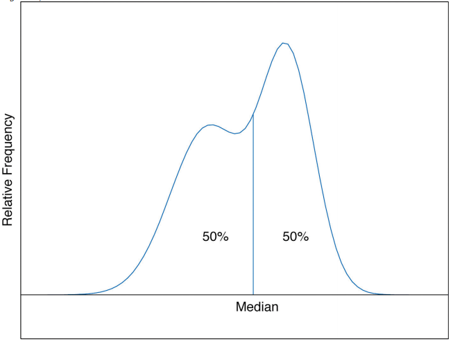
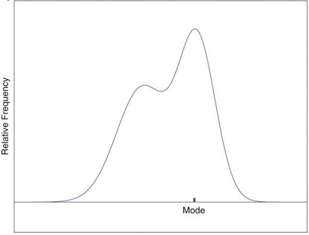

# 2-2. Measures of Central Location

## 1. Mean

**Example 1\)** 다음 데이터 세트의 sum\(x\), sum\(x^2\), sum\( \(x-1\) ^2 \)을 구하시오.

```text
1 3 4
```

**\[Solution\]**



```text
x <- c(1, 3, 4)
sum(x)
sum(x^2)
sum((x-1)^2)
```



```text
> sum(x)
## [1] 8
> sum(x^2)
## [1] 26
> sum((x-1)^2)
## [1] 13
```



> _The_ **sample mean** _of a set of_ _n_ _sample data is the number_ $$\bar{x}$$ _defined by the formula_
>
>                                                                      __$$\bar{x}=\frac{Σx}{n}$$


**Example 2\)** 다음의 표본 데이터의 평균을 구하라.

```text
2 -1 0  2
```

**\[Solution\]**



```text
x <- c( 2, -1, 0, 2)
mean(x)
```



```text
> mean(x)
## [1] 0.75
```



**Example 3\)** 무작위로 선발한 10명의 학생의 평균 평점은 다음과 같다. 표본의 평균을 구하라.

```text
1.90 3.00 2.53 3.71 2.12 1.76 2.71 1.39 4.00 3.33
```

**\[풀이\]**



```text
x <- c(1.90, 3.00, 2.53, 3.71, 2.12, 1.76, 2.71, 1.39, 4.00, 3.33)
mean(x)
```



```text
> mean(x)
## [1] 2.645
```



**Example 4\)** 가임기 년령을 넘긴 무작위로 선발된 19명의 여성의 데이터가 다음과 같다\(x는 자녀의 수, f는 그 값의 빈도\). 표본의 평균을 구하라.

```text
x   0   1   2   3   4
f   3   6   6   3   1
```

**\[Solution\]**



```text
x <- c(0, 1, 2, 3, 4)
f <- c(3, 6, 6, 3, 1)
mean <- sum(x * f) / sum(f)
mean
```



```text
> mean
## [1] 1.631579
```



> _The_ **population mean** _of a set of_ _N_ _population data is the number_  $$μ $$ _defined by the formula_
>
>                                                                __$$μ=\frac{Σx}{N}$$

## 2. Median

기업 직원의 연 평균 수입에 관심이 있다고 가정하자. 무작위로 선발된 직원 7명의 대략적인 연 수입은 다음과 같다\(단위 : 천 달러\)

```text
24.8 22.8 24.6 192.4 25.2 18.5 23.7
```

* 소숫점 1자리에서 반올림한 평균 수입액을 구하라.

**\[Solution\]**



```text
x <- c(24.8, 22.8, 24.6, 192.4, 25.2, 18.5, 23.7)
round(mean(x), 1)
```



```text
> round(mean(x), 1)
## [1] 47.4
```



* 위의 계산으로 볼 때 192.4 데이터는 이상치\(outlier\)로 판단이 된다. 따라서 이 데이터의 중심값으로 평균값이 아닌 중앙값\(median\)을 구하라.

**\[Solution\]**



```text
x <- c(24.8, 22.8, 24.6, 192.4, 25.2, 18.5, 23.7)
median(x)
```



```text
> median(x)
## [1] 24.6
```



> _The_ sample **median** $$\tilde{x}$$ _of a set of sample data for which there are an odd number of measurements is the **middle measurement** when the data are arranged in numerical order. The sample median_  $$\tilde{x}$$ _of a set of sample data for which there are an even number of measurements is the **mean of the two middle measurements** when the data are arranged in numerical order._

**\[ Median \]**



**Example 5\)** 다음 데이터 세트의 sample median을 구하라.

```text
-1 0 2 2
```

**\[Solution\]**



```text
x <- c(-1, 0, 2, 2)
median(x)
```



```text
> median(x)
## [1] 1
```



**Note :** median of the data set is the mean of 2nd and 3rd data -&gt; \(0 + 2\) / 2 = 1.

**Example 6\)** 다음 데이터 세트의 sample median을 구하라.

```text
1.39 1.76 1.90 2.12 2.53 2.71 3.00 3.33 3.71 4.00
```

**\[Solution\]**



```text
x <- c(1.39, 1.76, 1.90, 2.12, 2.53, 2.71, 3.00, 3.33, 3.71, 4.00)
median(x)
```



```text
> median(x)
## [1] 2.62
```




**Example 7\)** 다음 데이터 세트의 sample median을 구하라.

```text
0 0 0 1 1 1 1 1 1 2 2 2 2 2 2 3 3 3 4
```


**\[Solution\]**



```text
x <- c(0, 0, 0, 1, 1, 1, 1, 1, 1, 2, 2, 2, 2, 2, 2, 3, 3, 3, 4)
median(x)
```



```text
> median(x)
## [1] 2
```




The relationship between the mean and the median for several common shapes of distributions is shown in Figure "Skewness of Relative Frequency Histograms". The distributions in panels \(a\) and \(b\) are said to be _symmetric_ because of the symmetry that they exhibit. The distributions in the remaining two panels are said to be _skewed_. In each distribution we have drawn a vertical line that divides the area under the curve in half, which in accordance with Figure "The Median" is located at the median. The following facts are true in general:

1. When the distribution is symmetric, as in panels \(a\) and \(b\) of Figure "Skewness of Relative Frequency Histograms", the mean and the median are equal.
2. When the distribution is as shown in panel \(c\) of Figure "Skewness of Relative Frequency Histograms", it is said to be _skewed right_. The mean has been pulled to the right of the median by the long “right tail” of the distribution, the few relatively large data values.
3. When the distribution is as shown in panel \(d\) of Figure "Skewness of Relative Frequency Histograms", it is said to be _skewed left_. The mean has been pulled to the left of the median by the long “left tail” of the distribution, the few relatively small data values.

### **Skewness of Relative Frequency Histogram**


## 3. Mode

> _The_ sample **mode** _of a set of sample data is the **most frequently occurring value**._



**Example 8\)** 다음 데이터 세트의 mode\(최빈값\)를 구하라.

```text
-1 0 2 0
```

**\[Solution\]**



```text
x <- c(-1, 0, 2, 0)
y <- table(x)
names(which.max(y))
```



```text
> names(which.max(y))
## [1] "0"
```



### 

