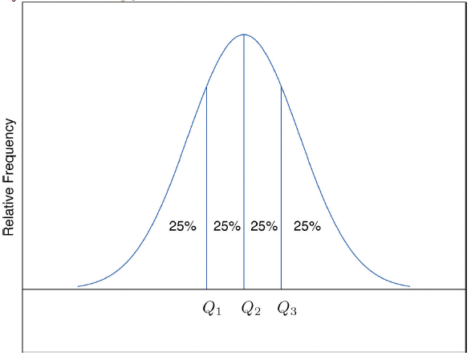

# 2-4. Relative Position of Data

## 1. Percentiles and Quartiles

> _Given an observed value_ $$x $$ _in a data set,_ $$x$$ _is the_ **Pth percentile** _of the data if the percentage of the data that are less than or equal to_  $$x$$ _is P. The number P is the_ **percentile rank** _of_ $$x$$ _._

**Example 27.** 다음의 데이터 세트에 대하여 1.39의 percentile을 구하라. 3.33의 percentile도 구하라.

```text
1.90  3.00  2.53  3.71  2.12  1.76  2.71  1.39  4.00  3.33
```

**\[Solution\]**



```text
x <- c(1.90, 3.00, 2.53, 3.71, 2.12, 1.76, 2.71, 1.39, 4.00, 3.33)

length(x[x <= 1.39]) / length(x) * 100   # x[x<=1.39] : elements of x less than or equal to 1.39
length(x[x <= 3.33]) / length(x) * 100   # x[x<=3.33] : elements of x less than or equal to 3.33
```



```text
> length(x[x <= 1.39]) / length(x) * 100
## [1] 10
```



```text
> length(x[x <= 3.33]) / length(x) * 100
## [1] 80
```




 The $$P$$th percentile cuts the data set in two so that approximately $$P$$ % of the data lie below it and $$(100−P)\% $$ of the data lie above it. In particular, the three percentiles that cut the data into fourths, as shown in Figure "Data Division by Quartiles", are called the quartiles. The following simple computational definition of the three quartiles works well in practice.

\[ Data Division by Quartiles\]



> For any data set: 
>
> 1. The **second quartile** Q2 of the data set is its median.  
> 2.  Define two subsets:  
>
> * the **lower set**: all observations that are strictly less than Q2;  
> *  the **upper set**: all observations that are strictly greater than Q2. 
>
>      3. The **first quartile** Q1 of the data set is the median of the lower set.

**Example 28.** 앞의 예에 있는 데이터 세트의 quartiles를 구하라.

**\[Solution\]**



```text
x <- c(1.90, 3.00, 2.53, 3.71, 2.12, 1.76, 2.71, 1.39, 4.00, 3.33)
y <- quantile(x)
y                # quartiles of x
y[3]             # second quartile of x
sort(x[x<y[3]])  # lower subset
sort(x[x>y[3]])  # upper subset
```



```text
> y
##     0%    25%    50%    75%   100% 
## 1.3900 1.9550 2.6200 3.2475 4.0000 
```



```text
> sort(x[x<y[3]])  # lower subset
## [1] 1.39 1.76 1.90 2.12 2.53
```



```text
> sort(x[x>y[3]])  # upper subset
## [1] 2.71 3.00 3.33 3.71 4.00
```



**Example 29.** 앞의 데이터 세트에 3.88을 추가하고 quartiles를 구하라.

**\[Solution\]**



```text
x <- c(1.90, 3.00, 2.53, 3.71, 2.12, 1.76, 2.71, 1.39, 4.00, 3.33, 3.88)
y <- quantile(x)
y                # quartiles of x
y[3]             # second quartile of x
sort(x[x<y[3]])  # lower subset
sort(x[x>y[3]])  # upper subset
```



```text
> y
##   0%  25%  50%  75% 100% 
## 1.39 2.01 2.71 3.52 4.00 
```



```text
> sort(x[x<y[3]])  # lower subset
## [1] 1.39 1.76 1.90 2.12 2.53
```



```text
> sort(x[x>y[3]])  # upper subset
## [1] 3.00 3.33 3.71 3.88 4.00
```



### **1.1 Five-Number summary** of the data set:

```text
{xmin, Q1, Q2, Q3, xmax}
```

* The five-number summary is used to construct a **box plot.**


### 1.2 Five Numbers in R

**Example 30. Example 28.**의 five-numbers를 구하라.

**\[ Solution \]**



```text
x <- c(1.90, 3.00, 2.53, 3.71, 2.12, 1.76, 2.71, 1.39, 4.00, 3.33)
fvn_x <- fivenum(x); fvn_x
```



```text
> fvn_x <- fivenum(x); fvn_x
## [1] 1.39 1.90 2.62 3.33 4.00

```




## 2. IQR

> **The interquartile range \(IQR\)** is the quantity :  
>
>                                                        $$    IQR = Q3−Q1 $$


**EXAMPLE 31.** **Example 28.**의 Box Plot을 작성하라. 그리고 IQR을 구하라.

**\[Solution\]**



```text
x <- c(1.90, 3.00, 2.53, 3.71, 2.12, 1.76, 2.71, 1.39, 4.00, 3.33)
boxplot(x)
quantile(x)
IQR(x)
```







```text
> quantile(x)
##     0%    25%    50%    75%   100% 
## 1.3900 1.9550 2.6200 3.2475 4.0000 
> IQR(x)
## [1] 1.2925
```



## 3. Box Plot

**Example 32.**  Draw the Box plot of **Example 28**.



```text
x <- c(1.90, 3.00, 2.53, 3.71, 2.12, 1.76, 2.71, 1.39, 4.00, 3.33)

# change the plot window size : (7×7) ⇒ (7×4)
win.graph(4, 7)

# 1. horizontal box plot : horizontal=TRUE
boxplot(x, main="Box Plot", col="cyan")

# 2. display the points ⇒ points()
len <- length(x)
points(rep(1,len), x)      # position of points : (x, 1) 

# 3. computing fivenumbers ⇒ fivenum() ⇒ (min, Q1, Q2, Q3, max)
xfn = fivenum(x); xfn

# display fivenumbers (min, Q1, Q2, Q3, max) ⇒ text(x, y, labels) 
text(0.7, xfn, labels=xfn, pos=3, cex=0.8)

# 4. display legend (Mean, Std Dev., n) ⇒ legend()
# paste0()
legend("topright", paste0(c("Mean", "Std Dev.", "n"), "=", 
	round(c(mean(x), sd(x), length(x)), 3)), text.col = 4, cex=0.8) 

```



















**Example 33.**  Horizontal Box Plot



```text
x <- c(1.90, 3.00, 2.53, 3.71, 2.12, 1.76, 2.71, 1.39, 4.00, 3.33)

# change the plot window size : (7×7) ⇒ (7×4)
win.graph(7, 4)

# 1. horizontal box plot : horizontal=TRUE
boxplot(x, horizontal=T, main="Box Plot", col="cyan")

# 2. display the points ⇒ points()
len <- length(x)           # the number of data
points(x, rep(1,len))      # position of points : (x, y=1) 

# 3. computing fivenumbers ⇒ fivenum() ⇒ (min, Q1, Q2, Q3, max)
xfn <- fivenum(x); xfn

#    display fivenumbers (min, Q1, Q2, Q3, max) ⇒ text(x, y, labels) 
text(xfn, 0.65, labels=xfn, pos=3, cex=0.8)   # cex=0.8 : size of tex
                                              # pos = 1, 2, 3, 4

# 4. display legend (Mean, Std Dev., n) ⇒ legend()
# paste0()
legend("topright", 
        paste0(c("Mean", "Std Dev.", "n"), "=", 
	    round(c(mean(x), sd(x), length(x)), 3)), 
	    text.col = 4,     # color of legend text 
	    cex=0.8)          # size of legend text

```



















**Example 34.** \(Two Factor Box plot\) 다음의 두 개의 데이터 세트를 하나의 Box-plot으로 표시하라.

```text
11분반 성적 : 42.5, 25, 37.5, 40, 27.5, 30, 35, 40, 25, 42.5, 
             37.5, 52.5, 37.5, 60, 65, 30, 32.5, 57.5, 32.5, 
             50, 55, 55, 40, 32.5, 35, 47.5
12분반 성적 : 32.5, 52.5, 40, 42.5, 12.5, 57.5, 67.5, 32.5, 
             57.5, 35, 45, 40, 72.5, 45, 47.5, 70, 45, 42.5, 
             50, 40, 57.5, 42.5, 57.5, 42.5, 35, 35, 32.5, 
             25, 67.5, 57.5, 37.5, 25
```

**\[ Solution \]**



```text
x <- c(42.5, 25, 37.5, 40, 27.5, 30, 35, 40, 25, 42.5, 
       37.5, 52.5, 37.5, 60, 65, 30, 32.5, 57.5, 32.5, 
       50, 55, 55, 40, 32.5, 35, 47.5)
y <- c(32.5, 52.5, 40, 42.5, 12.5, 57.5, 67.5, 32.5, 57.5, 35, 45, 40, 72.5,
       45, 47.5, 70, 45, 42.5, 50, 40, 57.5, 42.5, 57.5, 42.5, 35, 35, 32.5, 
       25, 67.5, 57.5, 37.5, 25)

boxnames <- c("11분반", "12분반")
boxplot(x, y, 
        main="2019학년도 중간고사 성적",
        names=boxnames, ylim=c(0, 80), notch=TRUE)

# 2. display the points ⇒ points()
# 11분반
len <- length(x)
points(rep(1,len), x)      # position of points : (x, 1) 
# 12분반
len <- length(y)
points(rep(2,len), y)      # position of points : (x, 1) 

# 3. computing fivenumbers ⇒ fivenum() ⇒ (min, Q1, Q2, Q3, max)
# display fivenumbers (min, Q1, Q2, Q3, max) ⇒ text(x, y, labels) 
text(0.7, fivenum(x), labels=fivenum(x), pos=3, cex=0.8)
text(1.7, fivenum(y), labels=fivenum(y), pos=3, cex=0.8)

# 4. display legend (Mean, Std Dev., n) ⇒ legend()
# paste0()
legend("bottomleft", paste0(c("Mean", "Std Dev.", "n"), "=", 
	round(c(mean(x), sd(x), length(x)), 3)), text.col = 4, cex=0.8) 
legend("bottomright", paste0(c("Mean", "Std Dev.", "n"), "=", 

```







## 4. Find out outliers


> $$[ Q1 - 1.5 * IQR, Q3 + 1.5 *IQR]$$의 범위를 벗어나는 데이터를 **outlier**라 한다.


**Example 35.** 다음의 데이터 세트에서 이상치\(outlier\)를 찾아내라.

```text
1.90 3.00 2.53 3.71 2.12 1.76 2.71 1.39 4.00 3.33 3.88 7.30
```

**\[ Solution 1 \]** 



```text
x <- c(1.90, 3.00, 2.53, 3.71, 2.12, 1.76, 2.71, 1.39, 4.00, 3.33, 3.88, 7.30)
y <- quantile(x); names(y) <- NULL

y1 <- y[2] - 1.5 * IQR(x); y1    # y[2] = Q1, lower limit
y2 <- y[4] + 1.5 * IQR(x); y2    # y[4] = Q3, uypper limit

which(x < y1)     # find out the index of x which is less than y1
which(x > y2)     # find out the index of x which is greater than y2

```



```text
> y1 <- y[2] - 1.5 * IQR(x); y1    # lower limit
## [1] -0.46625
> y2 <- y[4] + 1.5 * IQR(x); y2    # upper limit
## [1] 6.28375
> 
> which(x < y1)
## integer(0)
> which(x > y2)
## [1] 12

```

There is one outlier. The index of outlier is `12`. -&gt; x\[12\]



```text
> x[12]
## [1] 7.3
```



**\[ Solution 2 \]** 

Using `boxplot()`,  you can also find out outliers...



```text
x <- c(1.90, 3.00, 2.53, 3.71, 2.12, 1.76, 2.71, 1.39, 4.00, 3.33, 3.88, 7.30)

xbox <- boxplot(x)
xbox
```



```text
> xbox
## $stats  <- lower whisker : 1.390, lower hinge : 2.010, median : 2.855, upper hinge : 3.795, upper whisker : 4.000      [,1]
## [1,] 1.390
## [2,] 2.010
## [3,] 2.855
## [4,] 3.795
## [5,] 4.000

$n
## [1] 12

$conf
##         [,1]
## [1,] 2.04085
## [2,] 3.66915

$out      <- outlier
## [1] 7.3

$group
## [1] 1

$names
## [1] "1"

> 

```







```text
boxplot(x,horizontal=TRUE,outline=FALSE)     # outline=FALSE
```





참고자료 :

* [박스플롯에 대하여](https://boxnwhis.kr/2019/02/19/boxplot.html)
* Lower whisker and Upper Whisker : min and max
* [The Lower Hinge and Upper Hinge](https://www.statisticshowto.datasciencecentral.com/upper-hinge-lower-hinge/)


## 5. z-Score

> The **z-score** of an observation $$x$$ is the number of $$z$$ given by the computational formula   
>
>                          $$z =  (x - \bar{x})  /  {\sigma} $$      or       $$z = (x - \mu) / \sigma$$     
>
>  according to whether the data set is a sample or is the entire population.


**Example 36.** 다음과 같은 10명의 학생의 평균 평점에 대하여 z-score를 구하라.

```text
1.90 3.00 2.53 3.71 2.12 1.76 2.71 1.39 4.00 3.33
```

**\[Solution\]**



```text
x <- c(1.90, 3.00, 2.53, 3.71, 2.12, 1.76, 2.71, 1.39, 4.00, 3.33)
z_score <- (x - mean(x)) / sd(x)
round(z_score, 2)
```



```text
> round(z_score, 2)
##  [1] -0.86  0.41 -0.13  1.23 -0.61 -1.02  0.07 -1.45  1.56  0.79
```



**Example 37.**  최근에 등록했던 학생들 평균 평점의 평균과 표준편차가 각각 $$\mu = 2.70$$과 $$\sigma = 0.50$$ 이었다. Antonio와 Beatrice 두 학생의 z-score는 각각 -0.62와 1.28이었다. 그들의 평균 평점은 몇 점인가?

**\[Solution\]**



```text
mean <- 2.70
std <- 0.50
z_score <- c(-0.62, 1.28)
GPA <- mean + std * z_score
```



```text
> GPA <- mean + std * z_score; GPA
## [1] 2.39 3.34
```



