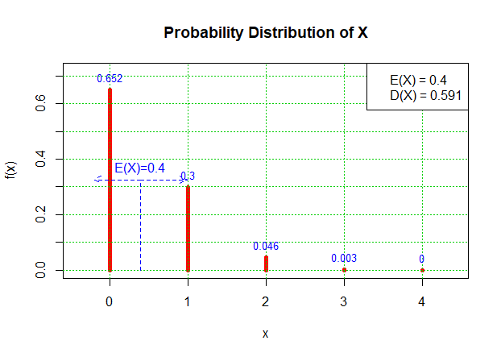

# 2-5. The Empirical Rule and Chebyshev’s Theorem

You probably have a good intuitive grasp of what the **average of a data set** says about that data set. In this section we begin to learn what the **standard deviation** has to tell us about the nature of the data set.

## 1. Empirical Rule

성인 남성 100명의 키\(인치 단위\)에 대한 데이터 세트가 있다.




### **The Empirical Rule** 

> If a data set has an _approximately bell-shaped relative frequency histogram_, then \(see Figure  "The Empirical Rule"\)  
>
> 1. approximately 68% of the data lie within one standard deviation of the mean, that is, in the interval with endpoints $$ \bar{x} ± 1s$$ for samples and with endpoints $$μ ± 1σ $$ for populations;  
> 2. approximately 95% of the data lie within two standard deviations of the mean, that is, in the interval with endpoints $$\bar{x} ± 2s$$ for samples and with endpoints $$μ ± 2σ$$ for populations; and 
> 3. approximately 99.7% of the data lies within three standard deviations of the mean, that is, in the interval with endpoints $$\bar{x} ±3s$$ for samples and with endpoints $$μ ± 3σ$$ for populations.


Two key points in regard to the Empirical Rule are that the data distribution must be _**approximately bell-shaped**_ and that the percentages are only _**approximately**_ true.

**Example 18\)** 18세 남성들의 키가 평균 69.6 인치, 표준편차 1.4 인치의 종모양 분포를 한다. 

a\) 이 사람들 중에 몇 퍼센트가 68.2인치와 71인치 사이에 있을까?

b\) 이 사람들 중에 95% 정도가 포함되는 평균의 구간을 구하라.

**\[Solution a\]**



```text
mean <- 69.6
std <- 1.4
x <- (68.2, 71)
z <- (x - mean) / std
```



```text
> z
## [1] -1  1
```



**\[Solution b\]**



```text
mean <- 69.6
std <- 1.4
z <- 2
x1 <- mean + z * std; x1
x2 <- mean - z * std; x2
```



```text
> x1 <- mean + z * std; x1
## [1] 72.4
> x2 <- mean - z * std; x2
## [1] 66.8
```




**Example 19\)** IQ 테스트 점수가 $$\mu = 100$$ 이고, $$\sigma = 10$$ 을 가진 종모양의 분포를 한다. 110, 120, 130 의 IQ를 가진 개인들과 관련하여 어떤 Empirical Rule이 적용되는가?

**\[Solution\]**



```text
mean <- 100
std <- 10
x <- c(110, 120, 130)
z <- (x - mean) / std ; z
```



```text
> z <- (x - mean) / std ; z
## [1] 1 2 3
```




## 2. Chebychev's Theorem

> For any numerical data set,  
>
> 1. at least $$3 / 4$$ of the data lie within two standard deviations of the mean, that is, in the interval with endpoints \($$\bar{x} ±  2s$$\) for samples and with endpoints \( $$μ ± 2σ$$ \) for populations;  
> 2. at least 8/9 of the data lie within three standard deviations of the mean, that is, in the interval with endpoints  \( $$\bar{x} ±  3s$$ \) for samples and with endpoints \( $$μ ± 3σ$$ \) for populations; 
> 3. at least $$(1 - 1/k^2)$$ of the data lie within k standard deviations of the mean, that is, in the interval with endpoints \($$\bar{x} ±  ks$$\) for samples and with endpoints \( $$μ ± kσ$$ \) for populations, where k is any positive whole number that is greater than 1.


It is important to pay careful attention to the words “at least” at the beginning of each of the three parts. The theorem gives _the minimum proportion of the data_ which must lie within a given number of standard deviations of the mean; the true proportions found within the indicated regions could be greater than what the theorem guarantees.


**Example 20\)** 표본의 크기 $$n = 50$$인 표본이 평균 $$\bar{x} = 28$$ , 그리고 표준편차 $$s = 3$$를 갖는다. 표본에 대한 어떠한 정보도 없이, \(22, 34\) 구간에 얼마나 많은 관측 데이터가 있을 수 있는가? 그리고 이 구간 밖에는 얼마나 많은 관측 데이터가 있다고 말할 수 있는가?

**\[Solution\]**



```text
mean <- 28
std <- 3
x <- c(22, 34)
z <- (x - mean) / std ; z
```



```text
> z <- (x - mean) / std ; z
## [1] -2  2
```




**Example 21\)** 작년 매일 평일 오전 8시에서 10시 사이에 혼잡한 교차로를 통과하는 차량의 수를 관찰하여 기록하였다. 이 데이터 세트는 규모가 $$n = 251$$ 이다. 표본평균 $$x^- = 725$$ 이고, 표준편차 $$s = 25$$ 이다. 다음 중 사실인 것을 찾아라.

1. On approximately 95% of the weekday mornings last year the number of vehicles passing through the intersection from 8:00 a.m. to 10:00 a.m. was between 675 and 775.
2. On at least 75% of the weekday mornings last year the number of vehicles passing through the intersection from 8:00 a.m. to 10:00 a.m. was between 675 and 775.
3. On at least 189 weekday mornings last year the number of vehicles passing through the intersection from 8:00 a.m. to 10:00 a.m. was between 675 and 775. 
4. On at most 25% of the weekday mornings last year the number of vehicles passing through the intersection from 8:00 a.m. to 10:00 a.m. was either less than 675 or greater than 775. 
5. On at most 12.5% of the weekday mornings last year the number of vehicles passing through the intersection from 8:00 a.m. to 10:00 a.m. was less than 675. 
6. On at most 25% of the weekday mornings last year the number of vehicles passing through the intersection from 8:00 a.m. to 10:00 a.m. was less than 675.

**\[Solution\]**



```text
mean <- 725
std <- 25
x <- c(675, 775)
z <- (x - mean) / std ; z
```



```text
> z <- (x - mean) / std ; z
## [1] -2  2
```



1. 데이터의 relative frequency histogram이 종모양인지 언급이 없기 때문에 Empirical Rule이 적용되지 않는다. 따라서 \(1\)번 문장은 맞지 않을 수 있다.
2. chebychev's theorem이 적용되어 이 문장은 맞다.
3. 189/251 = 75.3% 그러므로 이 문장은 \(2\)번 문장과 같다. 따라서 이 문장도 맞는다..
4. 이 문장은 \(2\)번 문장과 같다. 따라서 이 문장도 맞는다.
5. \(4\)번 문장은 사실이다. 그러나 \(5\)번 문장은 relative frequency histogram이 대칭적\(symmetric\)인지 여부를 알 수 없기 때문에 이 문장이 맞다고 말할 수 없다. 즉,  relative frequency histogram 이 대칭적이라면 이 문장은 맞는다.
6. 이 문장은 \(4\)번 문장과 같다. 따라서 이 문장도 맞는다.

