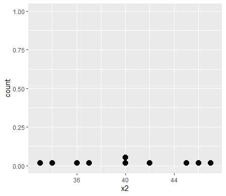
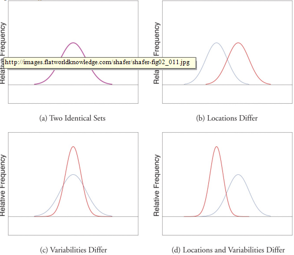

# Chapter 2. Descriptive Statistics

## 2.1 세 가지 주요 데이터 표현 방법

### 1\) Stem and Leaf Diagrams

통계학 강의를 듣고 있는 30명 학생의 시험 성적은 다음과 같다.

```text
86 80 25 77 73  76 100 90 69 93
90 83 70 73 73  70  90 83 71 95
40 58 68 69 100 78  87 97 92 73
```

위의 데이터를 가시화하기 위한 방법 중 하나가 **stem and leaf diagram**이다.

R에서는 이러한 데이터 표현을 위해 `stem()` 함수를 사용한다.

**Syntax :**

```text
stem(x, scale = 1, width = 80, atom = 1e-08)
```

**arguments :**

* x : 수치형 벡터
* scale = : 플롯의 길이를 제어
* width = : 원하는 플롯의 넓이
* atom = : tolerance

**\[Solution\]**



```text
score <- c(86, 80, 25, 77, 73,  76, 100, 90, 69, 93,
           90, 83, 70, 73, 73,  70,  90, 83, 71, 95,
           40, 58, 68, 69, 100, 78,  87, 97, 92, 73)
stem(score)
```



```text
##   The decimal point is 1 digit(s) to the right of the |
## 
##    2 | 5
##    3 | 
##    4 | 0
##    5 | 8
##    6 | 899
##    7 | 0013333678
##    8 | 03367
##    9 | 0002357
##   10 | 00
##
```



10의 자리 숫자가 stem이 되고, 1의 자리 숫자가 leaf가 됨을 알 수 있다.

**연습문제**  stem의 갯수를 반으로 줄여서 diagram을 그려라.

**\[Solution\]**



```text
stem(score, scale = 0.5)    # stem의 갯수를 50%로 줄임 -> 2, 4, 6, 8, 10 등
```



```text
##   The decimal point is 1 digit(s) to the right of the |
## 
##    2 | 5
##    4 | 08
##    6 | 8990013333678
##    8 | 033670002357
##   10 | 00
##
```



### 2\) Frequency Histograms

stem and leaf diagram은 대규모 데이터 세트에는 적합하지 않다.

이 때 사용되는 방법이 **빈도 히스토그램**이다.

```text
hist(x, main = paste("Histogram of ", xname), 
        xlim = range(breaks),
        ylim = NULL,
        xlab = xname, 
        ylab = 
        ... )
```

**arguments :**

* `x` : 히스토그램의 벡터 데이터
* `main =` : 히스토그램의 제목
* `xlim =` : x 축의 범위
* `ylim =` : y 축의 범위
* `xlab =` : x 축의 제목
* `ylab =` : y 축의 제목

이전의 stem and leaf diagram을 frequency histogram으로 그려라.

**\[Solution\]**



```text
require(lattice)
require(openintro)

histogram(score, type = "count",
          xlim = c(0, 110),
          ylim = c(0, 12),
           breaks = seq(5, 105, by=10))
```







### 3\) Relative Frequency Histogram

**\[Solution\]**



```text
histogram(score, type = "percent",
          xlim = c(0, 110),
          ylim = c(0, 40),
          breaks = seq(5, 105, by=10))
```



 





y 축의 값이 갯수\(count\)가 아닌 백분율\(percent\)로 출력된다.

### 4\) sample size and Relative Frequency Histograms

sample size가 커짐에 따라 전체 모양은 좌우 대칭의 종 모양이 된다.


### 5\) A Very Fine Relative Frequency Histogram


## 2.2 Measures of Central Location

### 1\) Mean

**Example 1\)** 다음 데이터 세트의 sum\(x\), sum\(x^2\), sum\( \(x-1\) ^2 \)을 구하시오.

```text
1 3 4
```

**\[Solution\]**



```text
x <- c(1, 3, 4)
sum(x)
sum(x^2)
sum((x-1)^2)
```



```text
> sum(x)
## [1] 8
> sum(x^2)
## [1] 26
> sum((x-1)^2)
## [1] 13
```



**Example 2\)** 다음의 표본 데이터의 평균을 구하라.

```text
2 -1 0  2
```

**\[Solution\]**



```text
x <- c( 2, -1, 0, 2)
mean(x)
```



```text
> mean(x)
## [1] 0.75
```



**Example 3\)** 무작위로 선발한 10명의 학생의 평균 평점은 다음과 같다. 표본의 평균을 구하라.

```text
1.90 3.00 2.53 3.71 2.12 1.76 2.71 1.39 4.00 3.33
```

**\[풀이\]**



```text
x <- c(1.90, 3.00, 2.53, 3.71, 2.12, 1.76, 2.71, 1.39, 4.00, 3.33)
mean(x)
```



```text
> mean(x)
## [1] 2.645
```



**Example 4\)** 가임기 년령을 넘긴 무작위로 선발된 19명의 여성의 데이터가 다음과 같다\(x는 자녀의 수, f는 그 값의 빈도\). 표본의 평균을 구하라.

```text
x   0   1   2   3   4
f   3   6   6   3   1
```

**\[Solution\]**



```text
x <- c(0, 1, 2, 3, 4)
f <- c(3, 6, 6, 3, 1)
mean <- sum(x * f) / sum(f)
mean
```



```text
> mean
## [1] 1.631579
```



### 2\) Median

기업 직원의 연 평균 수입에 관심이 있다고 가정하자. 무작위로 선발된 직원 7명의 대략적인 연 수입은 다음과 같다\(단위 : 천 달러\)

```text
24.8 22.8 24.6 192.4 25.2 18.5 23.7
```

* 소숫점 1자리에서 반올림한 평균 수입액을 구하라.

**\[Solution\]**



```text
x <- c(24.8, 22.8, 24.6, 192.4, 25.2, 18.5, 23.7)
round(mean(x), 1)
```



```text
> round(mean(x), 1)
## [1] 47.4
```



* 위의 계산으로 볼 때 192.4 데이터는 이상치\(outlier\)로 판단이 된다. 따라서 이 데이터의 중심값으로 평균값이 아닌 중앙값\(median\)을 구하라.

**\[Solution\]**



```text
x <- c(24.8, 22.8, 24.6, 192.4, 25.2, 18.5, 23.7)
median(x)
```



```text
> median(x)
## [1] 24.6
```




**\[ Median \]**


**Example 5\)** 다음 데이터 세트의 sample median을 구하라.

```text
-1 0 2 2
```

**\[Solution\]**



```text
x <- c(-1, 0, 2, 2)
median(x)
```



```text
> median(x)
## [1] 1
```



**Note :** median of the data set is the mean of 2nd and 3rd data -&gt; \(0 + 2\) / 2 = 1.

**Example 6\)** 다음 데이터 세트의 sample median을 구하라.

```text
1.39 1.76 1.90 2.12 2.53 2.71 3.00 3.33 3.71 4.00
```

**\[Solution\]**



```text
x <- c(1.39, 1.76, 1.90, 2.12, 2.53, 2.71, 3.00, 3.33, 3.71, 4.00)
median(x)
```



```text
> median(x)
## [1] 2.62
```



**Example 7\)** 다음 데이터 세트의 sample median을 구하라.

```text
0 0 0 1 1 1 1 1 1 2 2 2 2 2 2 3 3 3 4
```

**\[Solution\]**



```text
x <- c(0, 0, 0, 1, 1, 1, 1, 1, 1, 2, 2, 2, 2, 2, 2, 3, 3, 3, 4)
median(x)
```



```text
> median(x)
## [1] 2
```



**\[ Skewness of Relative Frequency Histogram \]**


### 3\) The Mode


**Example 8\)** 다음 데이터 세트의 mode\(최빈값\)를 구하라.

```text
-1 0 2 0
```

**\[Solution\]**



```text
x <- c(-1, 0, 2, 0)
y <- table(x)
names(which.max(y))
```



```text
> names(which.max(y))
## [1] "0"
```



## 2.3 Measures of Variability

다음의 두 데이터 세트가 있다. 각각의 데이터 세트를 점으로 표현한 것이 dot plot이다.

| Data Set 1 | 40 | 38 | 42 | 40 | 39 | 39 | 43 | 40 | 39 | 40 |
| :--- | :--- | :--- | :--- | :--- | :--- | :--- | :--- | :--- | :--- | :--- |
| Data Set 2 | 46 | 37 | 40 | 33 | 42 | 36 | 40 | 47 | 34 | 45 |



```text
library(ggplot2)
x1 <- c(40, 38, 42, 40, 39, 39, 43, 40, 39, 40)
x2 <- c(46, 37, 40, 33, 42, 36, 40, 47, 34, 45)
x <- data.frame(x1, x2)

ggplot(x, aes(x = x1)) + geom_dotplot()
ggplot(x, aes(x = x2)) + geom_dotplot()
```



  









참고사이트 : [https://ggplot2.tidyverse.org/reference/geom\_dotplot.html](https://ggplot2.tidyverse.org/reference/geom_dotplot.html)

### 1\) The Range

**Example 9\)** 앞의 2개의 데이터 세트의 range를 구하라.

**\[Solution\]**



```text
x1 <- c(40, 38, 42, 40, 39, 39, 43, 40, 39, 40)
x2 <- c(46, 37, 40, 33, 42, 36, 40, 47, 34, 45)
range_x1 <- max(x1) - min(x1)
range_x2 <- max(x2) - min(x2)
```



```text
> ( range_x1 <- max(x1) - min(x1) )
## [1] 5
> ( range_x2 <- max(x2) - min(x2) )
## [1] 14
```



**Note :** `range( )`function of R displays the minimun value and the maxim value of the data set.

### 2\) The Variance and The Standard Deviation

**Example 10\)** Data Set 2의 sample variance와 sample standard deviation을 구하라.

**\[Solution\]**



```text
x2 <- c(46, 37, 40, 33, 42, 36, 40, 47, 34, 45)
var(x2)
sd(x2)
```



```text
> var(x2)
## [1] 24.88889
> sd(x2)
## [1] 4.988877
```



**Example 11\)** 무작위로 선발한 10명의 학생의 평균 평점은 다음과 같다. sample variance와 sample standard deviation을 구하라.

```text
1.90 3.00 2.53 3.71 2.12 1.76 2.71 1.39 4.00 3.33
```

**\[풀이\]**



```text
x <- c(1.90, 3.00, 2.53, 3.71, 2.12, 1.76, 2.71, 1.39, 4.00, 3.33)
var(x)
sd(x)
```



```text
> var(x)
## [1] 0.7524278
> sd(x)
## [1] 0.8674259
```



**\[ Difference between Two Data Sets \]**



## 2.4 Relative Position of Data

### 1\) Percentiles and Quantiles

### 2\) IQR

## 2.5 The Empirical Rule and Chebychev's Theorem

### 1\) Empirical Rule

### 2\) Chebychev's Theorem

